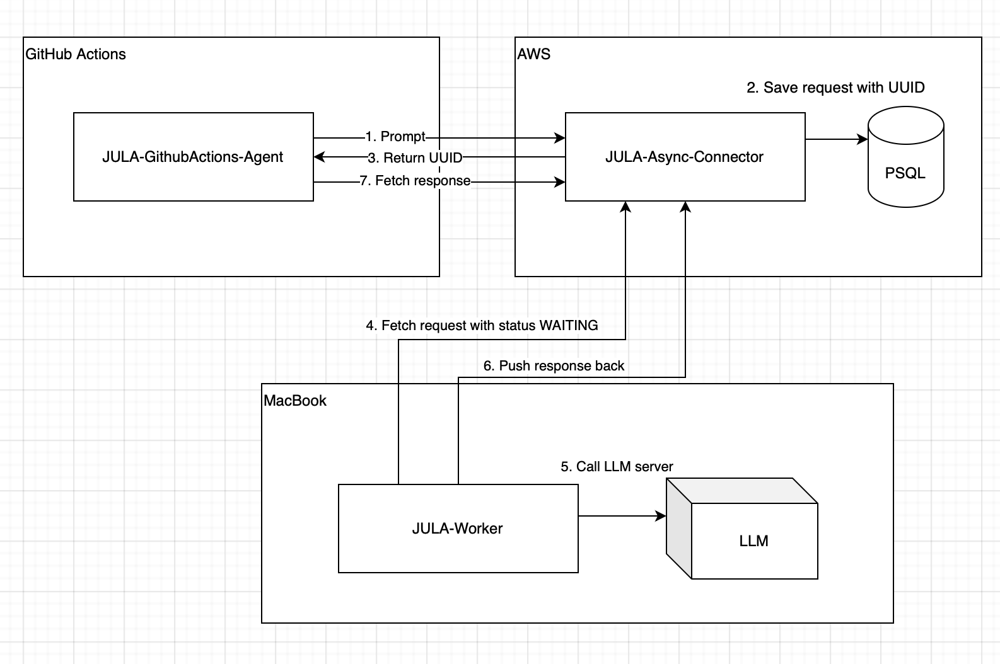

# JULA-Worker
***JU**nit **L**LM **A**utomator*

This repository is a part of PoC project aimed to automate JUnit-Based test generation using locally ran Large Language
Model server (Ollama).  
Other components:

- [JULA-GitHubActions-Agent](https://github.com/MarshallBaby/JULA-GitHubActions-Agent)
- [JULA-Async-Connector](https://github.com/MarshallBaby/JULA-Async-Connector)

## Worker component

This component is responsible for executing prompt on local machine. 
The process consists of three parts:
1. Retrieve waiting *Task* for Jula-Async-Connector
2. Run prompt on LLM service
3. Push the response back to Jula-Async-Connector

